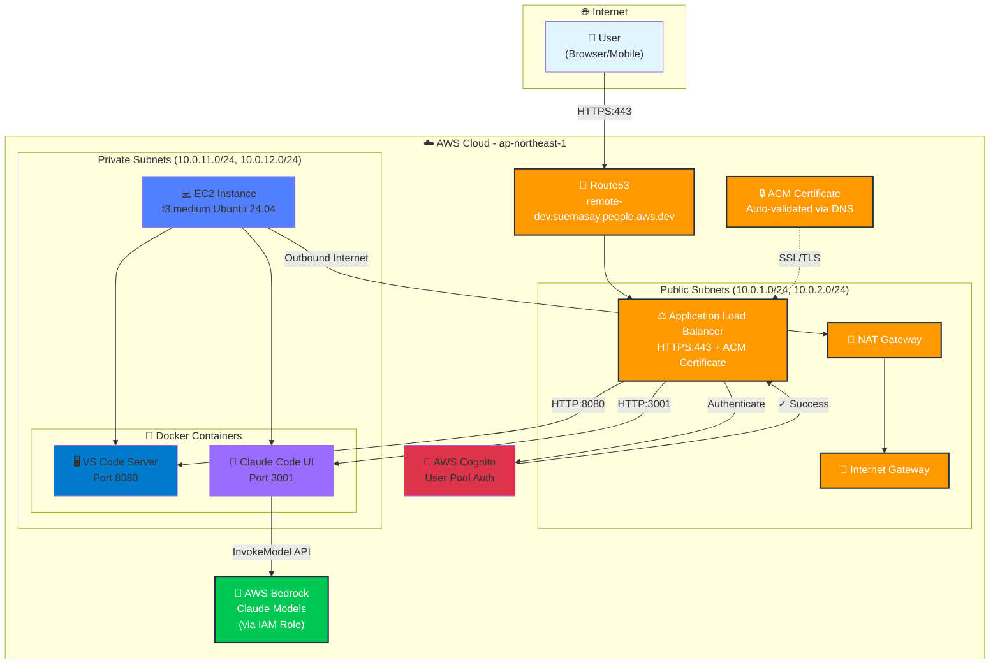

# Remote Development Server on AWS

Infrastructure as Code (Terraform) for deploying a secure remote development server on AWS EC2 with VS Code Server and Claude Code UI.

## 🚀 Quick Start

```bash
cd terraform
cp terraform.tfvars.example terraform.tfvars
# Edit terraform.tfvars with your configuration
terraform init
terraform plan
terraform apply
```

## 📋 What's Included

- **VS Code Server** - Full IDE experience in the browser
- **Claude Code UI** - AI-assisted coding interface
- **AWS Cognito** - Secure authentication
- **HTTPS** - Free ACM certificate with auto-renewal
- **SSM Session Manager** - Secure SSH access without keys
- **Automated Backups** - Daily snapshots with AWS Backup
- **Docker-based** - Easy updates and management

## 🏗️ Architecture




**Architecture Components:**

1. **Entry Point**: User connects via HTTPS to Route53 DNS
2. **Load Balancer**: Application Load Balancer with ACM SSL certificate
3. **Authentication**: AWS Cognito User Pool for secure access
4. **Compute**: EC2 instance in private subnet running Docker containers
   - VS Code Server (port 8080) - Accessible at `/vscode*`
   - Claude Code UI (port 3001) - Accessible at `/`
5. **AI Services**: Amazon Bedrock with Claude models
   - Claude Code UI connects to Bedrock for AI-powered coding assistance
   - IAM role permissions for `bedrock:InvokeModel` and `bedrock:InvokeModelWithResponseStream`
6. **Networking**: VPC with public/private subnets across multiple AZs
   - Internet Gateway for ALB public access
   - NAT Gateway for EC2 outbound internet access
7. **Security**: Security groups with least privilege access
8. **Storage & Monitoring**:
   - S3 for ALB access logs (encrypted with SSE-S3)
   - CloudWatch for application and VPC flow logs (encrypted with KMS)
   - KMS encryption for EBS volumes and CloudWatch logs
   - AWS Backup for daily snapshots
9. **Management**: Systems Manager for secure SSH access (no keys required)

**Key Security Features:**
- EC2 in private subnet (no public IP)
- All traffic encrypted in transit (HTTPS)
- Data at rest encryption (KMS for EBS/CloudWatch, SSE-S3 for ALB logs)
- Cognito authentication required for all access
- Security groups with least privilege
- IMDSv2 enforced on EC2
- VPC Flow Logs enabled
- Daily automated backups

## 📁 Repository Structure

```
.
├── README.md                    # This file
├── PLAN.md                      # Detailed implementation plan
└── terraform/                   # Terraform configuration
    ├── README.md                # Detailed deployment guide
    ├── versions.tf              # Terraform version constraints
    ├── providers.tf             # AWS provider configuration
    ├── variables.tf             # Input variables
    ├── locals.tf                # Local computed values
    ├── outputs.tf               # Output values
    ├── data.tf                  # Data sources
    ├── vpc.tf                   # VPC and networking
    ├── security_groups.tf       # Security groups
    ├── route53.tf               # DNS records
    ├── acm.tf                   # SSL certificates
    ├── cognito.tf               # Authentication
    ├── alb.tf                   # Load balancer
    ├── iam.tf                   # IAM roles and policies
    ├── ec2.tf                   # EC2 instance
    ├── backup.tf                # AWS Backup configuration
    ├── terraform.tfvars.example # Example configuration
    └── scripts/
        ├── user_data.sh         # EC2 bootstrap script
        └── docker-compose.yml   # Docker services
```

## 📖 Documentation

- **[Terraform README](terraform/README.md)** - Complete deployment guide, troubleshooting, and usage
- **[Implementation Plan](PLAN.md)** - Architecture decisions and design rationale

## 💰 Estimated Cost

| Component | Monthly Cost (ap-northeast-1) |
|-----------|-------------------------------|
| EC2 t3.medium | ~$30 |
| EBS 100GB | ~$8 |
| ALB | ~$23 |
| NAT Gateway | ~$33 |
| Data Transfer | ~$1.5 |
| **Total** | **~$96/month** |

## 🔧 Prerequisites

1. AWS Account with appropriate permissions
2. Existing domain in Route53 (or create one)
3. AWS CLI configured
4. Terraform >= 1.5.0

## 🛠️ Configuration

### Required Variables

```hcl
owner_email          = "your.email@example.com"
root_domain_name     = "example.com"
subdomain_name       = "dev"
route53_zone_id      = "Z1234567890ABC"
cognito_domain_prefix = "your-unique-prefix"
```

### Find Your Route53 Zone ID

```bash
aws route53 list-hosted-zones --query "HostedZones[?Name=='example.com.'].Id" --output text
```

## 🔐 Access

After deployment:

1. **Web Access**: `https://dev.your-domain.com`
2. **SSH Access**:
   ```bash
   aws ssm start-session --target <instance-id> --region ap-northeast-1
   ```

## 📚 Key Features

### Security
- ✅ HTTPS-only (HTTP redirects to HTTPS)
- ✅ AWS Cognito authentication
- ✅ Private subnet deployment
- ✅ SSM Session Manager (no SSH keys)
- ✅ Security groups with least privilege
- ✅ Encrypted EBS volumes
- ✅ IMDSv2 enforced

### High Availability
- ✅ Multi-AZ VPC
- ✅ ALB health checks
- ✅ Auto-recovery
- ✅ Daily backups

### Developer Experience
- ✅ VS Code Server (full IDE)
- ✅ Claude Code UI (AI assistance)
- ✅ Docker-based (easy updates)
- ✅ Git pre-installed
- ✅ AWS CLI v2
- ✅ Node.js 22

## 🔄 Updates

```bash
# Update infrastructure
terraform plan
terraform apply

# Update Docker containers
aws ssm start-session --target <instance-id>
cd /home/ubuntu
docker compose pull
docker compose up -d
```

## 🧹 Cleanup

```bash
terraform destroy
```

**Note:** AWS Backup vaults are not automatically deleted. Remove manually if needed.

## 📝 License

MIT License - See LICENSE file for details

## 📞 Support & References

### Official Documentation
- [AWS Documentation](https://docs.aws.amazon.com/)
- [Terraform Documentation](https://www.terraform.io/docs)
- [AWS Systems Manager Session Manager](https://docs.aws.amazon.com/systems-manager/latest/userguide/session-manager.html)

### Applications
- [VS Code Server (code-server)](https://github.com/coder/code-server) - VS Code running on a remote server, accessible through browser
- [Claude Code UI](https://github.com/siteboon/claudecodeui) - Web UI for Claude Code CLI with AI-assisted coding

### Guides & Tutorials
- [How to use VS Code Remote SSH with AWS Systems Manager](https://dev.classmethod.jp/articles/how-to-use-vscode-remote-ssh-with-aws-systems-manager/)
- [Claude Code + AWS Bedrock + EC2 + VS Code Remote SSH](https://dev.classmethod.jp/articles/claude-code-aws-bedrock-ec2-vscode-remote-ssh/)

